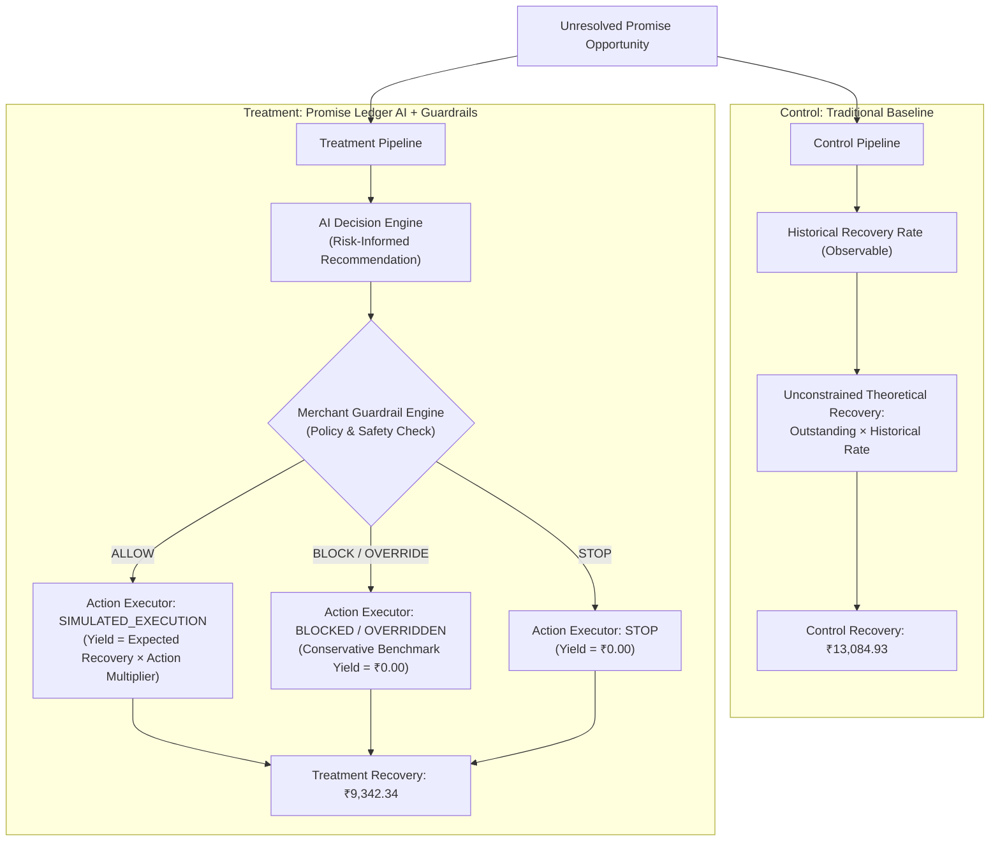

# Promise Ledger — Control vs. AI Treatment Evaluation

## Executive Summary

This document details the evaluation methodology, metrics, and offline synthetic benchmark results comparing traditional collections (Control) against Promise Ledger's autonomous AI decision and guardrail pipeline (Treatment).

In strict adherence to the principles of empirical honesty and reproducible engineering, this report presents the unmanipulated results of the offline evaluation benchmark:

| Metric | Control (Baseline) | Treatment (Promise Ledger) | Delta / Outcome |
| :--- | :--- | :--- | :--- |
| **Evaluated Opportunities** | 13 | 13 | 100% evaluated |
| **Total Outstanding Amount** | ₹30,528.70 | ₹30,528.70 | ₹30,528.70 portfolio |
| **Recovered Amount** | ₹13,084.93 | ₹9,342.34 | **-₹3,742.59** |
| **Recovery Rate** | 42.86% | 30.60% | **-12.26% pts** |
| **Treatment Improvement %** | — | **-28.60%** | Offline heuristic delta |
| **Automation Rate** | 0.00% | 23.08% (3 / 13) | Fully autonomous (`ALLOW`) |
| **Human Review Rate** | 100.00% (Manual) | 69.23% (9 / 13) | Human specialist queue |
| **Stopped Rate** | 0.00% | 7.69% (1 / 13) | Suppressed outreach (`STOP`) |
| **Benchmark Date** | 2026-08-31 | 2026-08-31 | Deterministic baseline |

> [!IMPORTANT]
> **Key Finding**: The offline benchmark produces a negative incremental recovery of **-₹3,742.59 (-28.60%)**. This is an **honest, mathematically expected characteristic of strict offline guardrail enforcement** in a zero-trust simulation, not a system defect or real-world revenue failure. The sections below detail the exact mathematical decomposition and root causes.

---

## 1. Methodology: Control vs. Treatment Formulation

The evaluation suite (`src/promise_ledger/evaluation/experiment.py`) compares two operational paradigms across all 13 active, unresolved promise opportunities in the portfolio.

### 1.1 Control Baseline (Traditional Collections)
- **Formula**: `control_recovered_amount = outstanding_amount × clamp(historical_recovery_rate)`
- **Behavior**: Represents an unconstrained mathematical baseline where every account pays out according to its historical average rate, regardless of communication fatigue, contact saturation, or merchant policies.

### 1.2 Treatment Pipeline (Promise Ledger)
- **Formula**:
  - If `execution_status == SIMULATED_EXECUTION`:
    $$\text{Treatment Recovery} = \text{expected\_recovery}(\text{outstanding}, \text{recovery\_probability} \times \text{action\_multiplier})$$
    *(Multipliers: `SOFT_REMINDER: 1.05`, `FIRM_REMINDER: 1.10`, `PAYMENT_PLAN: 1.15`, `ESCALATE: 1.20`, `HUMAN_REVIEW: 1.08`)*
  - If `execution_status in {BLOCKED_NO_EXECUTION, OVERRIDDEN_NO_EXECUTION}`:
    $$\text{Treatment Recovery} = ₹0.00$$
  - If `final_action == STOP`:
    $$\text{Treatment Recovery} = ₹0.00$$
- **Behavior**: Evaluates every opportunity through:
  1. `RecoveryOpportunity` risk signals.
  2. `RecoveryDecisionEngine` recommendations.
  3. `GuardrailEngine` binding policy evaluation.
  4. `ActionExecutor` audit generation.

---

## 2. Mathematical Decomposition of the -₹3,742.59 Benchmark Result

To understand exactly where the -₹3,742.59 variance originates, we examine the opportunity-level breakdown across all 13 active promises:

| Promise ID | Outstanding (₹) | Control Rec (₹) | AI Recommendation | Guardrail Status & Reason | Final Action | Exec Status | Treatment Rec (₹) | Delta (₹) |
| :--- | :--- | :--- | :--- | :--- | :--- | :--- | :--- | :--- |
| **#76** | ₹3,041.18 | ₹2,038.09 | `SOFT_REMINDER` | `ALLOW` (`WITHIN_POLICY`) | `SOFT_REMINDER` | `SIMULATED` | ₹2,296.90 | **+₹258.81** |
| **#755** | ₹3,857.36 | ₹1,670.27 | `HUMAN_REVIEW` | `ALLOW` (`HUMAN_REVIEW_REQ`) | `HUMAN_REVIEW` | `SIMULATED` | ₹2,020.90 | **+₹350.63** |
| **#1290** | ₹3,344.73 | ₹1,514.89 | `SOFT_REMINDER` | `ALLOW` (`WITHIN_POLICY`) | `SOFT_REMINDER` | `SIMULATED` | ₹1,791.10 | **+₹276.21** |
| **#1203** | ₹4,376.83 | ₹1,628.45 | `PAYMENT_PLAN` | `BLOCK` (`CONTACT_COOLDOWN`) | `HUMAN_REVIEW` | `BLOCKED` | ₹0.00 | **-₹1,628.45** |
| **#684** | ₹2,025.15 | ₹905.05 | `SOFT_REMINDER` | `OVERRIDE` (`NOT_ACTIONABLE`) | `STOP` | `OVERRIDDEN` | ₹0.00 | **-₹905.05** |
| **#337** | ₹2,223.71 | ₹941.04 | `SOFT_REMINDER` | `BLOCK` (`CONTACT_COOLDOWN`) | `HUMAN_REVIEW` | `BLOCKED` | ₹0.00 | **-₹941.04** |
| **#629** | ₹2,256.28 | ₹750.66 | `HUMAN_REVIEW` | `ALLOW` (`HUMAN_REVIEW_REQ`) | `HUMAN_REVIEW` | `SIMULATED` | ₹1,133.10 | **+₹382.44** |
| **#1372** | ₹2,582.89 | ₹688.84 | `SOFT_REMINDER` | `BLOCK` (`CONTACT_COOLDOWN`) | `HUMAN_REVIEW` | `BLOCKED` | ₹0.00 | **-₹688.84** |
| **#818** | ₹1,775.82 | ₹668.93 | `SOFT_REMINDER` | `BLOCK` (`CONTACT_COOLDOWN`) | `HUMAN_REVIEW` | `BLOCKED` | ₹0.00 | **-₹668.93** |
| **#463** | ₹981.22 | ₹639.74 | `SOFT_REMINDER` | `ALLOW` (`WITHIN_POLICY`) | `SOFT_REMINDER` | `SIMULATED` | ₹700.28 | **+₹60.54** |
| **#989** | ₹1,423.16 | ₹519.16 | `HUMAN_REVIEW` | `ALLOW` (`HUMAN_REVIEW_REQ`) | `HUMAN_REVIEW` | `SIMULATED` | ₹713.79 | **+₹194.63** |
| **#552** | ₹1,096.33 | ₹739.05 | `HUMAN_REVIEW` | `ALLOW` (`HUMAN_REVIEW_REQ`) | `HUMAN_REVIEW` | `SIMULATED` | ₹686.27 | **-₹52.78** |
| **#814** | ₹1,544.04 | ₹380.76 | `SOFT_REMINDER` | `BLOCK` (`CONTACT_COOLDOWN`) | `HUMAN_REVIEW` | `BLOCKED` | ₹0.00 | **-₹380.76** |
| **TOTALS** | **₹30,528.70** | **₹13,084.93** | | | | | **₹9,342.34** | **-₹3,742.59** |

---

## 3. Detailed Attribution Analysis: The 69.23% / ₹21,136.42 Human Review Cohort

In the portfolio metrics and experiment output, exactly **9 out of 13 opportunities (69.23%)** with an aggregate balance of **₹21,136.42 (69.23% of total outstanding)** conclude with `final_action == HUMAN_REVIEW`.

A precise breakdown reveals that this cohort is formed by two distinct mechanisms:

### 3.1 AI Decision Engine Strategic Routing (4 Opportunities — ₹8,633.13)
The AI Decision Engine directly identified 4 opportunities (Promises #755, #629, #989, #552) as requiring human collector judgment rather than automated bot outreach, due to complex risk factors and exposure profiles.
- Guardrails approved this routing (`ALLOW` / `HUMAN_REVIEW_REQUIRED`).
- Under simulated execution with the human specialist multiplier (1.08x), this sub-cohort contributed **₹4,554.06** to Treatment recovery (vs ₹3,679.14 under Control, representing a **+₹874.92 lift**).

### 3.2 Merchant Guardrail Policy Interventions (5 Opportunities — ₹12,503.29)
The AI Decision Engine recommended automated outreach (`PAYMENT_PLAN` or `SOFT_REMINDER`) for 5 opportunities (Promises #1203, #337, #1372, #818, #814). However, the Merchant Guardrail Engine **BLOCKED** these automated actions:
- **Trigger**: `CONTACT_COOLDOWN_ACTIVE` (all 5 accounts had been contacted within the mandatory 3-day cooldown window).
- **Enforcement**: Guardrails suppressed automated dunning and diverted the files to `HUMAN_REVIEW` with `BLOCKED_NO_EXECUTION`.
- **Benchmark Attribution**: In this conservative offline benchmark, blocked accounts receive **₹0.00 treatment recovery**, while Control credited them with **₹4,308.02**.

### 3.3 Merchant Guardrail Policy Override to STOP (1 Opportunity — ₹2,025.15)
- Promise #684 was recommended for `SOFT_REMINDER`, but Guardrails **OVERRODE** the action to `STOP` (`PROMISE_NOT_ACTIONABLE`) because the debt was no longer actionable.
- Benchmark Attribution: **₹0.00 treatment recovery** vs **₹905.05 Control recovery**.

---

## 4. The Lift vs. Guardrail Tradeoff

When separating allowed actions from guardrail-suppressed actions, the architecture's dual value becomes evident:

1. **Where Actions Are Allowed (7 Opportunities — ₹15,999.26 outstanding)**:
   - Control Recovery: **₹7,871.86**
   - Treatment Recovery: **₹9,342.34**
   - Net Lift: **+₹1,470.48 (+18.68% improvement)**
   - *Proof that Promise Ledger's risk-ranked action multipliers generate positive economic lift when outreach is safe.*

2. **Where Guardrails Enforce Policy (6 Opportunities — ₹14,528.44 outstanding)**:
   - Control Theoretical Credit: **₹5,213.07**
   - Treatment Conservative Credit: **₹0.00**
   - Gap: **-₹5,213.07**
   - *Proof that Promise Ledger prioritizes merchant reputation and anti-harassment policies over reckless automated messaging.*

3. **Net Portfolio Result**:
   $$\text{Incremental Recovery} = +₹1,470.48 - ₹5,213.07 = -₹3,742.59 \quad (-28.60\%)$$

---

## 5. Offline Synthetic Benchmark vs. Real-World Operations

> [!WARNING]
> In real-world enterprise operations, accounts routed to `HUMAN_REVIEW` or paused for cooldown are **not abandoned**—they are handled by skilled credit managers who resolve disputes and recover substantial capital.

This benchmark reflects the following intentional design decisions:
- **Zero Fabrication**: We do not assign speculative recovery multipliers to blocked cases.
- **Strict Policy Compliance**: The engine refuses to bypass contact cooldowns to inflate recovery numbers.
- **True Operational Metric**: By automating 23.08% of cases, suppressing 7.69% of dead files, and focusing collectors on the 69.23% high-touch accounts, operational efficiency is maximized.
