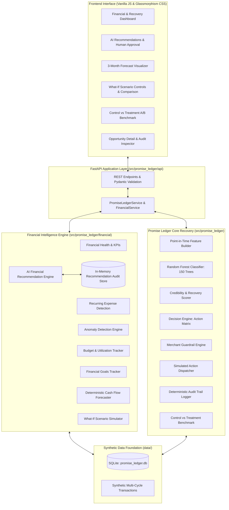

# Promise Ledger — AI Financial Intelligence & Risk Agent

> **Autonomous Receivables Recovery, Cash-Flow Forecasting & Decision Support Platform**  
> *Built for the Smart India Hackathon (SIH) FinTech Problem Statement*

Promise Ledger is an AI-assisted financial intelligence and risk platform. Originally designed as an autonomous B2B receivables recovery engine that transforms post-due-date "Promises to Pay" (PTP) into risk-calibrated, policy-guarded actions, Promise Ledger has expanded into a holistic financial intelligence agent.

The platform continuously analyzes transaction histories, recurring vendor commitments, operational budgets, and financial goals to detect anomalies, forecast 3-month forward cash flow, simulate adverse "what-if" stress scenarios, and generate explainable financial decision-support recommendations.

> **CRITICAL DISCLAIMER:**  
> Promise Ledger is a prototype decision-support agent operating strictly on **synthetic financial data**. All recovery actions, debtor reminders, and credit policies are **simulated**. No real-world banking rails, SMS/email gateways, or automated monetary debits are executed. High-impact decisions strictly require explicit human merchant authorization.

---

## Table of Contents

1. [Problem](#problem)
2. [Solution](#solution)
3. [Key Features](#key-features)
   - [Promise Intelligence](#promise-intelligence)
   - [Recovery Decision Engine](#recovery-decision-engine)
   - [Merchant Guardrails](#merchant-guardrails)
   - [Deterministic Audit Trail](#deterministic-audit-trail)
   - [Financial Intelligence Layer](#financial-intelligence-layer)
   - [Cash Flow Forecasting](#cash-flow-forecasting)
   - [What-If Scenario Simulator](#what-if-scenario-simulator)
   - [AI Financial Recommendations & Human-in-the-Loop](#ai-financial-recommendations--human-in-the-loop)
   - [Control vs. Treatment Evaluation](#control-vs-treatment-evaluation)
4. [Architecture](#architecture)
5. [ML & Risk Methodology](#ml--risk-methodology)
6. [Financial Risk Methodology](#financial-risk-methodology)
7. [API Reference](#api-reference)
8. [Tech Stack](#tech-stack)
9. [Project Structure](#project-structure)
10. [Setup & Installation](#setup--installation)
11. [Recommended Demo Flow](#recommended-demo-flow)
12. [Verified Example Outputs](#verified-example-outputs)
13. [Limitations](#limitations)
14. [Roadmap](#roadmap)
15. [Safety & Data Disclaimer](#safety--data-disclaimer)
16. [License](#license)
17. [Author & Project](#author--project)

---

## Problem

In B2B commerce, overdue invoices routinely enter an unmonitored limbo state known as **"Promise to Pay" (PTP)**. When an invoice crosses its due date, commercial buyers frequently commit to payment on an agreed future date. Today, credit, collections, and treasury teams face severe systemic bottlenecks:

1. **Uncalibrated Credibility:** Credit teams treat all promises equally, lacking objective predictive signals to determine whether a promise is a genuine commitment or a stall tactic.
2. **Untracked Working Capital at Risk:** Millions in receivables sit on ledgers with unknown break probabilities, directly destabilizing cash runway and working capital forecasting.
3. **High-Friction, Indiscriminate Dunning:** Traditional dunning spams debtors with generic notifications, damaging valuable customer relationships without improving recovery yields.
4. **Lack of Enforceable Policy Guardrails:** Automated outreach often violates communication cooling-off periods, contact limits, and credit dispute protections.
5. **Prediction Without Decision:** Merely predicting risk is insufficient. Modern finance teams require a closed loop connecting:
   $$\text{Prediction} \longrightarrow \text{Decision} \longrightarrow \text{Guardrail} \longrightarrow \text{Simulated Action} \longrightarrow \text{Audit Log}$$

---

## Solution

Promise Ledger solves this through two deeply coupled, mutually reinforcing loops:

### 1. The Promise-to-Action Loop (Receivables Recovery)
```
Promise to Pay
   ↓
Point-in-Time Risk Prediction (Random Forest)
   ↓
Expected Recovery Estimation (Balance × Probability)
   ↓
Money-at-Risk Opportunity Prioritization
   ↓
AI Recovery Decision (Action Matrix)
   ↓
Merchant Guardrails (Safety Enforcement)
   ↓
Simulated Execution (Zero Side Effects)
   ↓
Deterministic Audit Trail (SHA-256 Hashes)
   ↓
Control vs Treatment Benchmark Evaluation
```

### 2. The Financial Intelligence & Decision Support Loop
```
Synthetic Financial Ledger Data
   ↓
Holistic Health Analysis (Cash, Inflow, Outflow, Net Burn)
   ↓
Statistical Anomaly & Recurring Commitment Detection
   ↓
Promise Ledger Receivables-to-Cash Bridge
   ↓
3-Month Cash Flow Forecast (Incorporating ML Expected Recovery)
   ↓
What-If Scenario Simulation (Stress Testing Collection & Cost Shifts)
   ↓
AI Financial Decision Recommendations (6 Explainable Rules)
   ↓
Explicit Human Merchant Approval ("AI Recommends, Merchant Decides")
```

---

## Key Features

### Promise Intelligence
- **Promise Credibility Score (0–100):** A normalized score derived from machine-learned break probability that quantifies debtor commitment reliability.
- **Promise Break Probability:** Evaluated point-in-time using observable customer history (payment timeliness, broken promise history, debt ratios).
- **Explainable Risk Contributors:** Lists precise factor contributions (e.g., past broken promises, invoice age, balance exposure).
- **Expected Recovery ($\text{Expected Yield}$):**
  $$\text{Expected Recovery} = \text{Outstanding Amount} \times \text{Recovery Probability}$$
  where Recovery Probability synthesizes historical customer recovery rate, on-time payment rate, and current promise credibility.
- **At-Risk Opportunity Ranking:** Ranks all outstanding commercial accounts by economic money-at-risk rather than simplistic invoice due dates.

### Recovery Decision Engine
Generates context-sensitive, advisory recovery recommendations:
- `SOFT_REMINDER`: Courteous digital reminder for credible debtors with minor delays.
- `FIRM_REMINDER`: Structured payment reminder with formal terms for deteriorating credibility.
- `PAYMENT_PLAN`: Restructuring recommendation for high-exposure accounts experiencing liquidity strain.
- `ESCALATE`: Senior management / legal collections recommendation for chronic non-performance.
- `HUMAN_REVIEW`: Escalation to human credit managers when risk profiles or amounts exceed automated policy bounds.
- `STOP`: Immediate cessation of automated outreach when active commercial disputes or customer complaints exist.

### Merchant Guardrails
Merchant guardrails act as an independent, non-bypassable safety layer evaluating every decision:
- **Maximum Automated Contacts:** Caps the total number of automated reminder dispatches.
- **Cooldown Period:** Enforces a mandatory multi-day quiet window between reminders.
- **Autonomous Value Ceiling:** Prohibits automated action on invoices exceeding merchant-configured thresholds (e.g., ₹50,000).
- **Payment Plan Duration Limit:** Restricts payment installment schedules to policy limits.
- **Dispute Stop Conditions:** Instantly halts collection activity on disputed invoices.

> **Governance Invariant:**  
> The Decision Engine *recommends*. The Guardrail Engine *evaluates independently* (`ALLOW`, `BLOCK`, or `OVERRIDE`). The Executor only performs *simulated dispatches*.

### Deterministic Audit Trail
Every evaluation generates an immutable, tamper-evident audit record identified by a deterministic SHA-256 hash:
- Timestamp & Evaluation Date
- Promise ID, Customer ID, Invoice ID
- AI Recommended Action vs. Final Policy Action
- Guardrail Outcome & Explicit Trigger Reason
- Outstanding Amount, Expected Recovery, and Break Probability
- Execution Status (`SIMULATED_SUCCESS`, `BLOCKED`, `OVERRIDDEN`)

### Financial Intelligence Layer
- **Financial Health KPIs:** Tracks Current Cash Balance, Monthly Income, Monthly Expenses, Net Cash Flow, Total Receivables, and Financial Risk Score (0–100).
- **Receivables-Risk Bridge:** Connects accounts with $\ge 40\%$ promise break probability directly to monthly cash runway stress.
- **Recurring Expense Detection:** Identifies predictable operational vendor commitments (Payroll, Office Leases, Facilities, Subscriptions) and calculates fixed overhead burn.
- **Financial Anomaly Detection:** Detects statistical spending spikes (e.g., $+125\%$ cloud compute surges) and duplicate vendor billing within 24-hour windows.
- **Merchant Budget Tracking:** Tracks department/category spend against allocated monthly caps, flagging `WARNING` ($\ge 85\%$) and `OVER_BUDGET` ($> 100\%$).
- **Financial Goals Progress:** Monitors capital reserves (Emergency Reserves, Equipment Upgrades, Tax Provisions) against target deadlines.
- **Integrated Transaction Ledger:** Categorized multi-cycle historical ledger supporting real-time filtering by `ALL`, `INCOME`, and `EXPENSE`.

### Cash Flow Forecasting
- **3-Month Rolling Projection:** Deterministic month-by-month cash flow forecast (September 2026 – November 2026) starting from current liquid reserves.
- **Phased ML Expected Recovery Integration:** Naive models unrealistically assume 100% receivables realization. Promise Ledger discounts receivables using the Random Forest expected recovery ($\approx ₹14,731.96$ against $₹30,528.70$ gross debt), phased realistically across the horizon (50% Month 1, 30% Month 2, 20% Month 3).
- **Fixed Operational Burn Floor:** Enforces a hard recurring commitment floor ($₹1,18,838.21/\text{month}$) alongside operational run-rates.
- **Explainable Confidence Indicator:** Evaluates forecast certainty (rated `MEDIUM` / 0.72) based on income stability vs. recurring burden and receivables volatility.

### What-If Scenario Simulator
- **Stress-Testing Parameters:**
  1. *Receivable Collection Delays:* $0$ to $90$ days.
  2. *Operating Expense Changes:* $-30\%$ to $+50\%$.
  3. *Additional Monthly Expenses:* $₹0$ to $₹2,00,000$ (e.g., emergency Capex, hardware replacement).
  4. *Recovery Rate Adjustments:* $-50\%$ to $+50\%$.
- **Comparative Output Grid:** Compares Base Case vs. Scenario Case vs. Net Delta for Ending Cash, Net Cash Flow, Cash Runway (months), and Financial Risk Level.
- **Zero Database Mutation Guarantee:** All simulation calculations occur in-memory. Zero database rows are modified or inserted.

### AI Financial Recommendations & Human-in-the-Loop
A transparent, rule-based decision support engine evaluating multi-source financial signals across 6 core areas:
1. **Receivables Risk:** Prioritizes at-risk promises when high-break-probability exposure exceeds working capital safety margins.
2. **Anomaly Remediation:** Formulates vendor audit and credit memo requests upon detecting high-severity billing anomalies.
3. **Budget Caps:** Recommends procurement spend freezes on categories exceeding budget caps.
4. **Recurring Overhead:** Recommends contract renegotiations when fixed commitments consume $> 60\%$ of total expenses.
5. **Cash Runway:** Advises tightening customer credit terms when scenario simulations indicate runway contraction under 3 months.
6. **Goal Trajectory:** Proposes surplus allocation adjustments to keep capital replacement goals on schedule.

> **Human-in-the-Loop Principle:**  
> **"AI recommends, Merchant decides."**  
> High-impact recommendations display prominent `🔒 HUMAN APPROVAL REQUIRED` badges. Merchants review supporting evidence, estimated financial impacts, and explicitly click `Approve` or `Reject`.

### Control vs. Treatment Evaluation
A deterministic offline benchmark comparing traditional collections against Promise Ledger's AI pipeline:
- **Control Baseline:** Simulates recovery using historical debtor payment rates on the unresolved batch.
- **AI Treatment Pipeline:** Applies machine learning credibility scoring, recovery prioritization, action matrix recommendations, and merchant guardrail constraints.
- **Measured Metrics:** Total Recovered Amount, Recovery Rate (%), Incremental Yield, Automation Rate, Human-Review Escalation Rate, and Dispute Stopped Rate.

---

## Architecture



---

## ML & Risk Methodology

Promise Ledger enforces strict point-in-time data cleanliness to prevent target leakage:

1. **Chronological Splitting:** Training data is split strictly on chronological boundaries (80% historical training, 20% out-of-time evaluation). No future information leaks into feature sets.
2. **Excluded Contaminants:** Unresolved/pending promises and simulator parameters (e.g., synthetic intent flags) are excluded from ML features.
3. **Pure Python Random Forest:** The break prediction model consists of a 150-tree Random Forest implemented purely in standard-library Python. It requires zero heavy C++ or binary dependencies, guaranteeing determinism across platforms.
4. **Observable Behavioral Features:**
   - Customer historical promise-fulfillment rate
   - On-time payment track record
   - Current promise age (elapsed days since promise creation)
   - Invoice amount and outstanding balance ratio
   - Debtor commercial payment terms
5. **Promise Credibility Score:** Derived directly from model break probability:
   $$\text{Credibility Score} = \max(0, \min(100, \text{round}((1 - \text{Break Probability}) \times 100)))$$
6. **Expected Recovery Calculation:**
   $$\text{Expected Recovery} = \text{Outstanding Balance} \times \left(0.55 \times \text{HistRate} + 0.20 \times \text{OnTimeRate} + 0.25 \times \frac{\text{Credibility}}{100}\right)$$

---

## Financial Risk Methodology

The overall business financial risk score is a deterministic, explainable index ($0 - 100$) combining five weighted structural risk factors:

| Risk Factor | Trigger Condition | Max Weight |
|---|---|---|
| **Receivables Break Risk** | Proportion of receivables held by accounts with $\ge 40\%$ break probability | 30 pts |
| **Recurring Expense Burden** | Recurring commitments consuming $> 65\%$ of monthly expenses | 25 pts |
| **Budget Overruns** | Category spending exceeding allocated monthly budgets | 20 pts |
| **Transaction Anomalies** | Severity and frequency of statistical spending deviations | 15 pts |
| **Liquidity & Cash Runway** | Cash reserves providing $< 3$ months operational runway | 10 pts |

- **Risk Levels:** `LOW` ($0 - 39$), `MEDIUM` ($40 - 69$), `HIGH` ($70 - 100$).

---

## API Reference

The FastAPI application provides structured JSON endpoints with Pydantic request/response validation:

### Core Promise Ledger APIs
| Method | Endpoint | Description |
|---|---|---|
| `GET` | `/health` | Health check and pipeline status |
| `GET` | `/portfolio/summary` | Portfolio-level metrics, distributions, and recovery totals |
| `GET` | `/opportunities` | Ranked list of at-risk collection opportunities |
| `GET` | `/opportunities/{promise_id}` | Detailed opportunity view with debtor profile and promise history |
| `POST` | `/opportunities/{promise_id}/evaluate` | Evaluates promise through ML, decision engine, and guardrails |
| `GET` | `/evaluation/experiment` | Control vs. AI treatment offline recovery evaluation |

### Financial Intelligence APIs (Phase 1)
| Method | Endpoint | Description |
|---|---|---|
| `GET` | `/financial/summary` | Financial health overview, cash balance, and receivables bridge |
| `GET` | `/financial/transactions` | Filtered financial transaction history (`type=ALL\|INCOME\|EXPENSE`) |
| `GET` | `/financial/recurring-expenses` | Detected recurring vendor commitments and overhead ratios |
| `GET` | `/financial/anomalies` | Statistical anomalies, spending spikes, and duplicate billing |
| `GET` | `/financial/budgets` | Departmental budget limits, actual cycle spend, and utilization |
| `GET` | `/financial/goals` | Financial goal progress, saved amounts, and target dates |

### Forecasting & Decision Support APIs (Phase 2)
| Method | Endpoint | Description |
|---|---|---|
| `GET` | `/financial/forecast` | 3-month cash flow forecast incorporating phased ML recovery |
| `POST` | `/financial/scenario` | What-if scenario stress simulation (delays, expense changes, burn) |
| `GET` | `/financial/recommendations` | Explainable AI financial recommendations requiring human review |
| `POST` | `/financial/recommendations/{id}/review` | Human merchant review action (`APPROVE`, `REJECT`, `REVIEW`) |

---

## Tech Stack

- **Backend Framework:** Python 3.10+, [FastAPI](https://fastapi.tiangolo.com/), [Uvicorn](https://www.uvicorn.org/)
- **Data Validation & Typing:** [Pydantic v2](https://docs.pydantic.dev/)
- **Data Foundation:** SQLite 3 (Standard Library)
- **Machine Learning:** Pure Python Random Forest Classifier & StandardScaler (Self-contained, zero external ML binaries)
- **Testing & Validation:** Python `unittest`, `starlette.testclient`, `httpx`
- **Frontend Architecture:** Modern Semantic HTML5, Vanilla CSS3 (Selective Glassmorphism, CSS Custom Properties, Responsive Flex/Grid), Vanilla JavaScript (ES6+, Fetch API, Event Delegation)
- **Design Palette:** Slate / Navy surfaces, Royal Blue primary, Emerald Green success, Amber warning, Red danger *(No purples; strict Indian Rupee `₹` formatting)*

---

## Project Structure

```
promise_ledger/
├── data/
│   └── promise_ledger.db              # Synthetic SQLite multi-year relational dataset
├── frontend/
│   ├── css/
│   │   └── dashboard.css              # Minimalist fintech glassmorphic design system
│   ├── js/
│   │   ├── api-client.js              # PromiseLedgerAPI client class
│   │   ├── app.js                     # Dashboard state management and event handlers
│   │   └── utils.js                   # Currency (₹), date, and percentage formatters
│   ├── index.html                     # Unified single-page responsive dashboard
│   └── tests/
│       └── test_frontend.js           # Frontend unit test suite
├── scripts/
│   ├── run_e2e_testclient.py          # Comprehensive in-process live validation script
│   └── validate_e2e_live.py           # Live HTTP integration validation script
├── src/
│   └── promise_ledger/
│       ├── api/
│       │   ├── app.py                 # FastAPI application and route declarations
│       │   ├── models.py              # Pydantic schemas for core recovery endpoints
│       │   └── service.py             # Orchestration service bridging ML and storage
│       ├── config.py                  # Global deterministic seeds and paths
│       ├── db/                        # SQLite connection helpers and schema queries
│       ├── evaluation/                # Control vs Treatment benchmark logic
│       ├── features/                  # Point-in-time leakage-safe feature builder
│       ├── financial/                 # Phase 1 & 2 Financial Intelligence Layer
│       │   ├── forecasting.py         # 3-Month rolling cash flow forecaster
│       │   ├── models.py              # Pydantic schemas for financial intelligence
│       │   ├── recommendations.py     # AI financial recommendation rules & store
│       │   ├── service.py             # FinancialService integration layer
│       │   ├── simulation.py          # What-if scenario simulation engine
│       │   └── synthetic_data.py      # Multi-cycle transaction & budget generators
│       ├── guardrails/                # Merchant policy validation engine
│       ├── models/                    # Self-contained Random Forest classifier
│       └── recovery/                  # Action matrix decision engine & audit logger
├── tests/                             # 147 Unit, integration, and regression tests
│   ├── test_api.py
│   ├── test_features.py
│   ├── test_financial.py              # Phase 1 API test suite
│   ├── test_frontend_validation.py    # Python-based DOM and asset validator
│   ├── test_guardrails.py
│   ├── test_orchestration.py
│   ├── test_phase2_endpoints.py       # Phase 2 Forecast, Scenario, & Recs test suite
│   └── ...
├── requirements.txt                   # Minimal runtime dependencies (FastAPI, Uvicorn, HTTPX)
├── .gitignore                         # Comprehensive release exclusions
└── README.md                          # Project documentation
```

---

## Setup & Installation

### Prerequisites
- Python 3.10, 3.11, 3.12, or 3.14 installed on your system.
- PowerShell or Command Prompt (Windows).

### 1. Clone the Repository
```powershell
git clone https://github.com/PrakharPandeyk14/promise-ledger.git
cd promise-ledger
```

### 2. Set Up Virtual Environment
```powershell
python -m venv .venv
.\.venv\Scripts\activate
```

### 3. Install Dependencies
```powershell
pip install -r requirements.txt
```

### 4. Run the Full Test Suite
Execute all 147 test cases to verify complete regression integrity:
```powershell
$env:PYTHONPATH="src"; $env:PYTHONIOENCODING="utf-8"; .\.venv\Scripts\python.exe -m unittest discover -s tests -p "test_*.py"
```
*Expected Result: `Ran 147 tests ... OK`*

### 5. Launch the Dashboard
Start the local FastAPI application server:
```powershell
.\.venv\Scripts\python.exe -m uvicorn --app-dir src promise_ledger.api.app:app --host 127.0.0.1 --port 8000
```
Open your browser and navigate to:
```
http://127.0.0.1:8000
```

---

## Recommended Demo Flow

1. **Dashboard Overview:** Open `http://127.0.0.1:8000`. Review top metrics: Money at Risk (`₹30,528.70`), Expected Recovery (`₹14,731.96`), and Recovery Yield (`48%`).
2. **Financial Health:** Navigate to **Financial Health**. Review Current Cash Balance (`₹5,27,112.08`), Net Cash Flow (`+₹45,112.08`), and the direct ML connection highlighting the 7 high-break-risk accounts.
3. **Inspect Anomalies & Recurring Costs:** Review the 8 detected recurring vendor commitments (`₹1,18,838.21/mo`) and flagged transaction anomalies (e.g., AWS compute surge of $+125\%$).
4. **Inspect Budgets & Goals:** Observe the over-budget status on Software ($154.7\%$) and Other ($345\%$), and inspect capital reserve goal funding.
5. **Explore 3-Month Forecast:** Scroll to the **Cash Flow Forecast**. Observe the 3-month projection cards (Sep–Nov 2026) showing how the $₹14,731.96$ expected recovery is phased across the horizon.
6. **Simulate a What-If Scenario:** Under **What-If Scenario Simulator**, set collection delay to `15 days`, operating expense change to `+10%`, and additional monthly expense to `₹20,000`. Click **Simulate Scenario**. Observe the ending cash drop to $₹5,74,606.76$ ($-₹1,12,802.65$ delta) and runway contract from $4.0$ to $2.7$ months.
7. **Review AI Financial Recommendations:** Scroll to **AI Financial Recommendations**. Review high-priority recommendation cards (Receivables Risk, Anomaly Dispute, Budget Caps) displaying the `🔒 HUMAN APPROVAL REQUIRED` badge.
8. **Execute Human Decision:** Click **✓ Approve** on recommendation `REC-FIN-001`. Observe the immediate visual confirmation, recorded status update, and recalculated pending approval count.
9. **Inspect Receivables Opportunities:** Switch to **Opportunities**. Click **Inspect** on Promise `#76` to inspect its credibility score, invoice details, and risk factors.
10. **Trigger Autonomous Evaluation:** Click **⚡ EVALUATE & GET RECOMMENDATION**. Observe the 5-step semantic decision chain: AI Recommendation (`SOFT_REMINDER`) $\rightarrow$ Guardrail Outcome (`ALLOW`) $\rightarrow$ Final Action $\rightarrow$ Simulated Dispatch $\rightarrow$ SHA-256 Audit ID.
11. **Review A/B Benchmark:** Navigate to **Experiments** to compare baseline recovery against Promise Ledger's guardrail-constrained AI pipeline.

---

## Verified Example Outputs

All values below reflect verified deterministic outputs from the active test suite:

- **Starting Cash Balance:** ₹5,27,112.08
- **Monthly Income:** ₹2,15,000.73
- **Monthly Expenses:** ₹1,69,888.65
- **Net Operating Cash Flow:** +₹45,112.08
- **Financial Risk Score:** 70.0 / 100 (`MEDIUM`)
- **Total Outstanding Receivables:** ₹30,528.70
- **Model Expected Recovery:** ₹14,731.96
- **Elevated Break Risk Debt:** ₹17,368.67 across 7 debtor accounts
- **Total Recurring Monthly Commitments:** ₹118,838.21 / month
- **3-Month Projected Final Cash:** ₹6,87,409.41 (Forecast Confidence: `MEDIUM`)
- **What-If Simulated Ending Cash (15d Delay, +10% Exp, ₹20k Burn):** ₹5,74,606.76
- **What-If Cash Runway Contraction:** 4.0 months $\rightarrow$ 2.7 months
- **Overall Regression Suite:** 147 tests passed (100% pass rate)

---

## Limitations

- **Synthetic Data:** All customers, invoices, transactions, and debtor interactions are generated deterministically.
- **Simulated Execution:** The platform dispatches zero real-world SMS, WhatsApp, email, or automated bank payments.
- **Deterministic Decision Support:** The forecasting engine and recommendation layer utilize transparent statistical formulas and rule-based decision logic rather than black-box Large Language Models.
- **In-Memory Decision State:** Recommendation approval/rejection statuses are tracked in-memory for demonstration workflows.
- **No Multi-Tenant Authentication:** User authentication, RBAC, and merchant account isolation are intentionally deferred for subsequent enterprise releases.
- **No Real Banking Rails:** Not connected to live Open Banking, UPI, or Core Banking Systems (CBS).

---

## Roadmap

- [ ] **Multi-Tenant Merchant Authentication:** JWT-based merchant login and multi-organization data isolation.
- [ ] **Account Aggregator & Open Banking:** Integration with RBI Account Aggregator (AA) framework for live bank statement feeds.
- [ ] **Persistent Audit Storage:** Relational database persistence for recommendation approvals and merchant override logs.
- [ ] **Calibrated Continuous ML:** Online learning pipelines to retrain promise-break models upon invoice settlement events.
- [ ] **Automated ERP Connectors:** Ingest real-time accounting ledgers from Tally, Zoho Books, SAP, and QuickBooks.

---

## Safety & Data Disclaimer

This project uses synthetic financial data for demonstration and development purposes. No real customer financial data or live payment execution is involved. Promise Ledger is an advisory decision-support prototype and does not provide certified financial, accounting, or legal advice.

---

## License

License: Not yet specified.

---

## Author & Project

Developed as an AI-powered financial intelligence and autonomous B2B receivables recovery agent for the Smart India Hackathon (SIH) FinTech track. Designed to empower merchant finance teams with predictive risk scoring, transparent guardrails, and decision-support intelligence.
