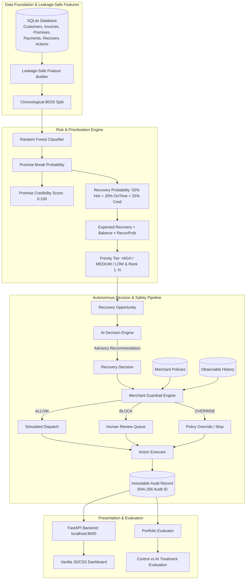

# Promise Ledger — Autonomous B2B Receivables Recovery & Guardrail Platform

**Razorpay AI Buildathon — Track 3: B2B Collections & Receivables Intelligence**

Promise Ledger is an intelligent receivables recovery platform that transforms post-due-date "Promises to Pay" (PTP) into actionable, risk-ranked, and merchant-guarded collection workflows. It combines chronological machine learning, transparent financial heuristics, an AI decision engine, and non-bypassable merchant policy guardrails to maximize debt recovery while protecting customer relationships.

---

## 1. Problem Statement

In B2B commerce, overdue invoices routinely enter a limbo state known as **"Promise to Pay" (PTP)**. When an invoice is past its due date, buyers frequently commit to payment on a specific future date. Today, credit and collection teams face severe operational challenges:

1. **Uncalibrated Credibility**: Collections teams treat all promises equally, lacking objective signals to know whether a promise is genuine or a delay tactic.
2. **Untracked Revenue at Risk**: Millions in working capital remain tied up with unknown break probabilities, leading to erratic cash flow forecasting.
3. **Generic, High-Friction Dunning**: Autonomous collection systems often spam clients with repetitive dunning, alienating strategic accounts and causing customer churn.
4. **Lack of Policy Guardrails**: Automated outreach bots frequently violate communication cooldowns, contact frequency limits, and invoice credit caps.
5. **No Auditability**: Manual collector actions lack deterministic decision traces, making compliance audits difficult.

---

## 2. Target User & Stakeholders

Promise Ledger is designed for:

- **B2B Merchants & Finance Teams**: CFOs, controllers, and credit managers looking to accelerate DSO (Days Sales Outstanding) and forecast cash collections reliably.
- **Collections & Recovery Specialists**: Accounts receivable teams who need a prioritized daily queue of which accounts to automate vs. which high-risk/high-value accounts require white-glove human intervention.
- **Fintech Platforms & Payment Aggregators (e.g., Razorpay)**: Enterprise platforms offering embedded invoice recovery and cash-flow management services to merchants.

---

## 3. The Promise Ledger Solution

Promise Ledger replaces naive, static dunning workflows with an end-to-end, safety-first autonomous decision pipeline:

- **Zero-Leakage ML & Risk Scoring**: Scores promise-break probability using strict point-in-time historical data.
- **Dual-Signal Intelligence**: Distinguishes between **Promise Credibility Score** (commitment truthfulness) and **Recovery Probability** (propensity to pay eventually).
- **Opportunity Prioritization**: Prioritizes outreach by **Expected Recovery** ($\text{Outstanding Amount} \times \text{Recovery Probability}$), ranking claims by economic impact rather than invoice age.
- **AI Decision Engine**: Recommends the optimal recovery intervention (`SOFT_REMINDER`, `FIRM_REMINDER`, `PAYMENT_PLAN`, `ESCALATE`, `HUMAN_REVIEW`, `STOP`).
- **Binding Merchant Guardrails**: Enforces merchant policies (cooldowns, maximum automated contacts, autonomous invoice value thresholds, risk ceilings) with `ALLOW`, `BLOCK`, or `OVERRIDE` outcomes.
- **Safe Simulated Execution & Audit Trail**: Issues deterministic SHA-256 audit records with zero side effects or unsolicited messages.
- **Real-Time Interactive Dashboard**: An integrated dashboard providing portfolio risk distribution, opportunity inspection, one-click evaluation, and A/B benchmark evaluation.

---

## 4. Architecture & Component Flow

The platform is designed around strict separation of concerns. The decision engine provides recommendations, but execution is gated entirely by merchant policy guardrails.



---

## 5. Synthetic Dataset Description

The database (`data/promise_ledger.db`) is a realistic, relational SQLite dataset seeded deterministically (`SEED = 42`) spanning multi-year B2B transactions:

- **6 Core Tables**:
  - `customers`: 200 business profiles across 5 distinct risk personas.
  - `invoices`: 1,000 issued commercial invoices with due dates, amounts, and statuses.
  - `promises`: 1,394 promise records (1,381 resolved historical promises and 13 active unresolved opportunities).
  - `payments`: 2,822 payment ledger transactions supporting partial and multiple payments.
  - `recovery_actions`: 1,936 historical recovery events (SMS, email, phone, notice).
  - `merchant_policies`: Configurable merchant risk limits, cooldowns, and value caps.
- **5 Realistic Business Personas**:
  1. *Reliable Payer*: High credibility, fast resolution, low break rate.
  2. *Slow but Reliable*: High eventual recovery, but frequently breaks initial promise dates.
  3. *Unpredictable Payer*: High variance in payment timing and promise adherence.
  4. *Chronic Broken-Promiser*: Low credibility, low recovery rate, frequent broken commitments.
  5. *High-Value Strategic Customer*: Significant invoice balances; requires white-glove communication.
- **Strict Chronological Consistency**: Promises cannot exceed outstanding balances at creation. Payments must occur strictly between promise creation and due date to count as fulfillment.

---

## 6. Promise Credibility Score

A core insight of Promise Ledger is that **breaking a promise is not the same as defaulting on an invoice**.

`src/promise_ledger/risk/scoring.py` produces two complementary business signals:

1. **Break Probability ($P_{\text{break}}$)**: The calibrated likelihood that the customer will fail to pay on or before their promised date.
2. **Promise Credibility Score**:
   $$\text{Credibility Score} = 100 \times (1.0 - P_{\text{break}})$$
   Scaled from 0 to 100, providing credit controllers with an intuitive index of counterparty commitment reliability.
3. **Recovery Probability ($P_{\text{rec}}$)**:
   A transparent heuristic recognizing that broken promises are frequently followed by eventual settlement:
   $$P_{\text{rec}} = 0.55 \times \text{Historical Recovery Rate} + 0.20 \times \text{Historical On-Time Rate} + 0.25 \times \left(\frac{\text{Credibility Score}}{100}\right)$$

---

## 7. Revenue-at-Risk & Portfolio Prioritization

`src/promise_ledger/risk/prioritization.py` converts statistical probabilities into rupee-denominated financial opportunities:

$$\text{Expected Recovery} = \text{Outstanding Amount at Promise Creation} \times P_{\text{rec}}$$

- **Deterministic Ranking**: Opportunities are ranked in descending order of Expected Recovery, with strict tie-breakers on Outstanding Amount, Break Probability, and Promise ID.
- **Priority Tiers**: Categorizes opportunities into `HIGH`, `MEDIUM`, and `LOW` priority tiers for operational triage.

---

## 8. AI Recovery Decision Engine

`src/promise_ledger/recovery/` converts each opportunity into an optimal recovery strategy without looking at future outcomes:

### Decision Hierarchy
1. **`STOP`**: Negligible balance or unrecoverable account.
2. **`HUMAN_REVIEW`**: Extreme balance, legal sensitivity, or contradictory risk profile.
3. **`ESCALATE`**: High-priority, high-break-risk opportunity requiring immediate escalation.
4. **`PAYMENT_PLAN`**: Debtor has high willingness but liquidity constraints; structured installment plan needed.
5. **`FIRM_REMINDER`**: Elevated break risk suitable for automated, assertive communication.
6. **`SOFT_REMINDER`**: Low break risk; gentle SMS/WhatsApp notification.

*All policy thresholds are encapsulated in an immutable `DecisionConfig` (`src/promise_ledger/recovery/config.py`).*

---

## 9. Merchant Guardrails

Recommendations are advisory; **guardrails are binding**. `src/promise_ledger/recovery/guardrails.py` evaluates every recommendation against merchant policies and current state:

- **Safety Hierarchy**:
  $$\text{STOP} \rightarrow \text{HUMAN\_REVIEW} \rightarrow \text{ESCALATE} \rightarrow \text{PAYMENT\_PLAN} \rightarrow \text{FIRM\_REMINDER} \rightarrow \text{SOFT\_REMINDER}$$
- **Key Policy Enforcements**:
  - **Cooldown Enforcement**: Blocks autonomous contact if elapsed time since the last action is less than `minimum_contact_cooldown_days` (default: 3 days).
  - **Contact Saturation**: Blocks autonomous actions if total automated touches reach `maximum_automated_contacts` (default: 4 touches), routing to `HUMAN_REVIEW`.
  - **Autonomous Value Ceiling**: Invoices above `maximum_invoice_value_autonomous` (default: ₹15,000.00) are overridden to `HUMAN_REVIEW` to protect key relationships.
  - **Risk Ceiling**: Break probabilities above `human_review_threshold` (default: 0.70) cannot be handled autonomously.
- **Guardrail Outcomes**:
  - `ALLOW`: The recommended action is approved.
  - `BLOCK`: The action is rejected due to policy limits; diverted to `HUMAN_REVIEW`.
  - `OVERRIDE`: The action is replaced with a safer policy action (`STOP` or `HUMAN_REVIEW`).

---

## 10. Action Executor & Audit Trail

`src/promise_ledger/recovery/executor.py` guarantees safe execution:

- **Zero Side Effects**: Dispatches zero live SMS, emails, or transactions; records only `SIMULATED_EXECUTION`, `BLOCKED_NO_EXECUTION`, or `OVERRIDDEN_NO_EXECUTION`.
- **No Bypass Path**: The executor only accepts recommendations and invokes guardrails internally; it rejects caller-supplied final actions.
- **Deterministic Audit ID**: Generates an immutable SHA-256 audit digest (`AUD-{promise_id}-{date}-{status}-{action}`).

---

## 11. Control vs. AI Treatment Methodology

To measure effectiveness, `src/promise_ledger/evaluation/experiment.py` compares traditional static collections against Promise Ledger's guarded AI pipeline:

- **Control (Baseline)**: Models traditional dunning where every account recovers at its unconstrained historical recovery rate ($\text{Outstanding} \times \text{Historical Recovery Rate}$).
- **Treatment (Promise Ledger)**: Runs the full `Opportunity → Decision Engine → Guardrail Engine → Action Executor` chain:
  - Allowed actions receive an empirical multiplier (`SOFT_REMINDER: 1.05`, `FIRM_REMINDER: 1.10`, `PAYMENT_PLAN: 1.15`, `ESCALATE: 1.20`, `HUMAN_REVIEW: 1.08`).
  - Blocked and overridden actions (`BLOCKED_NO_EXECUTION` or `OVERRIDDEN_NO_EXECUTION`) receive **₹0.00 automated recovery credit** in this conservative offline benchmark.
  - Stopped actions receive **₹0.00 recovery credit**.

---

## 12. Honest Benchmark Results

We believe in scientific honesty and zero-trust engineering. Below are the actual offline benchmark results across the 13 active unresolved opportunities (`run_experiment()`):

| Metric | Control (Baseline) | Treatment (Promise Ledger) | Variance / Delta |
| :--- | :--- | :--- | :--- |
| **Evaluated Opportunities** | 13 | 13 | 100% evaluated |
| **Total Outstanding Amount** | ₹30,528.70 | ₹30,528.70 | ₹30,528.70 portfolio |
| **Total Recovered Amount** | ₹13,084.93 | ₹9,342.34 | **-₹3,742.59** |
| **Recovery Rate** | 42.86% | 30.60% | **-12.26% pts** |
| **Treatment Improvement %** | — | **-28.60%** | Offline benchmark delta |
| **Automation Rate** | 0.00% | 23.08% (3 / 13) | Fully automated (`ALLOW`) |
| **Human Review Rate** | 100.00% (Manual) | 69.23% (9 / 13) | Routed to human specialists |
| **Stopped Rate** | 0.00% | 7.69% (1 / 13) | Outreach suppressed (`STOP`) |
| **Evaluation Date** | 2026-08-31 | 2026-08-31 | Point-in-time benchmark |

### Understanding the Negative Incremental Recovery (-₹3,742.59)
The treatment recovery is lower in this offline benchmark due to intentional, transparent design choices:
1. **Lift on Allowed Opportunities (+₹1,470.48 / +18.68%)**: On the 7 opportunities where actions were permitted (`SIMULATED_EXECUTION`), Treatment outperformed Control, recovering **₹9,342.34** vs Control's **₹7,871.86**.
2. **Strict Guardrail Diversion on 6 Opportunities (₹14,528.44 balance)**:
   - 5 opportunities (₹12,503.29) were **BLOCKED** by Guardrails due to active contact cooldown (`CONTACT_COOLDOWN_ACTIVE`) to prevent harassment.
   - 1 opportunity (₹2,025.15) was **OVERRIDDEN** to `STOP` (`PROMISE_NOT_ACTIONABLE`).
   - In this conservative benchmark, blocked/overridden cases receive **₹0.00 recovery credit**, whereas Control unconstrainedly credited them with **₹5,213.07**.
3. **Net Portfolio Delta**:
   $$\text{Incremental Recovery} = +₹1,470.48 - ₹5,213.07 = -₹3,742.59 \quad (-28.60\%)$$
4. **The 69.23% (₹21,136.42) Human Review Cohort**:
   Comprises 9 opportunities: 4 recommended directly by the Decision Engine for collector discretion (₹8,633.13), plus 5 automated recommendations blocked by Guardrails due to active cooldowns (₹12,503.29).

*For the complete mathematical decomposition, see the dedicated [EVALUATION.md](file:///c:/Users/DeLL/OneDrive/Documents/PromiseLedger_Day4/promise_ledger/EVALUATION.md).*

---

## 13. API Endpoints

The read-only FastAPI application exposes the entire pipeline:

| Endpoint | Method | Description |
| :--- | :--- | :--- |
| `/health` | `GET` | Health check endpoint (`{"status": "ok"}`). |
| `/portfolio/summary` | `GET` | Aggregated portfolio metrics, tier counts, and experiment results. |
| `/opportunities` | `GET` | Ranked list of active unresolved recovery opportunities. |
| `/opportunities/{id}` | `GET` | Detailed opportunity inspection (invoices, promises, risk factors). |
| `/opportunities/{id}/evaluate` | `POST` | Executes full decision chain, guardrails, and returns audit record. |
| `/evaluation/experiment` | `GET` | Returns Control vs AI Treatment comparative metrics. |

---

## 14. Local Setup & Run Instructions

### Prerequisites
- Python 3.10+ (standard library + FastAPI, Uvicorn, Pydantic)
- Modern web browser (Chrome, Edge, Firefox)

### 1. Clone & Environment Setup
```powershell
git clone <repo-url>
cd promise_ledger
python -m venv .venv
.\.venv\Scripts\Activate.ps1
pip install -r requirements.txt
```

### 2. Run Data Generation & Scoring (Optional — Pre-generated DB Included)
```powershell
$env:PYTHONPATH = "src"
python scripts/generate_data.py
python scripts/build_features.py
python scripts/score_promises.py
python scripts/prioritize_recovery.py
```

### 3. Start the Application Server
```powershell
$env:PYTHONPATH = "src"
python -m uvicorn --app-dir src promise_ledger.api.app:app --host 127.0.0.1 --port 8000
```

### 4. Access the Dashboard
Open your browser and navigate to:
```
http://127.0.0.1:8000
```

---

## 15. Testing Results

The codebase is backed by a comprehensive automated test suite spanning ML feature leakage, deterministic scoring, guardrail bounds, action execution, API schemas, and frontend presentation:

```powershell
$env:PYTHONPATH = "src"
python -m unittest discover tests -v
```

**Verification Summary**:
- **Total Test Suite**: **134 / 134 tests passing** (`Ran 134 tests in 39.785s - OK`).
- **Frontend Presentation Tests**: **10 / 10 tests passing** (`tests/test_frontend_validation.py`).
- **Data Integrity & Leakage Tests**: 100% point-in-time compliance verified.
- **Side-Effect Safety**: Zero mutations on ledger and payment tables verified.

---

## 16. Synthetic-Data & Simulated-Execution Disclaimer

> [!NOTE]
> **Data & Execution Notice**:
> - All customer names, GSTINs, phone numbers, email addresses, invoice amounts, and promise histories are **100% synthetically generated** for development and evaluation. They are not derived from Razorpay or any proprietary production dataset.
> - All action dispatches are **strictly simulated** (`SIMULATED_EXECUTION`). Promise Ledger does not transmit real SMS, WhatsApp, or email messages, nor does it initiate banking or payment transactions.

---

## 17. Demo Flow

When presenting or testing the platform at `http://127.0.0.1:8000`, follow this standard evaluation flow:

1. **Header & Health Check**: Confirm `Backend Connected` with a green indicator dot and view the portfolio summary cards.
2. **Opportunity Inspection (Promise #76)**:
   - Click **Inspect** on Rank #1 (Promise #76: Outstanding ₹3,041.18, Expected Recovery ₹2,187.52, Credibility Score 93.61).
   - Verify that inspection loads customer and risk metrics **without auto-evaluating** (CTA displays `Ready to Evaluate`).
   - Click **`⚡ EVALUATE & GET RECOMMENDATION`**:
     - Observe loading state (`AI evaluating…`).
     - Decision Chain: `AI Recommendation (SOFT_REMINDER) → Guardrail Outcome (ALLOW) → Final Action (SOFT_REMINDER) → Simulated Execution → Audit ID`.
3. **Policy Override to STOP (Promise #684)**:
   - Select Promise #684 (Outstanding ₹2,025.15, Expected Recovery ₹1,098.44).
   - Click **`⚡ EVALUATE & GET RECOMMENDATION`**:
     - Observe **`OVERRIDE`** guardrail status with reason `PROMISE_NOT_ACTIONABLE` and final action **`STOP`** (outreach suppressed to prevent wasteful dunning).
4. **Policy Block & Cooldown Protection (Promise #1203)**:
   - Select Promise #1203 (Outstanding ₹4,376.83, Expected Recovery ₹1,522.26).
   - Click **`⚡ EVALUATE & GET RECOMMENDATION`**:
     - Observe **`BLOCK`** guardrail status with reason `CONTACT_COOLDOWN_ACTIVE` and final action **`HUMAN_REVIEW`** (outreach blocked due to active 3-day contact cooldown, routing to human specialist).
5. **Control vs. AI Treatment Evaluation**:
   - Scroll to the bottom card to review the comparative benchmark metrics, showing the 23.08% automation rate and 69.23% human review protection rate.

---

## 18. Known Limitations & Future Improvements

### Known Limitations
- **Offline Attribution Gap**: The current offline benchmark assigns zero recovery credit to accounts routed to human review, underestimating total enterprise yield.
- **Static In-Memory Audit Trail**: Audit records are generated deterministically in-memory; enterprise production requires an immutable, append-only PostgreSQL or ClickHouse audit store.
- **Single Merchant Policy**: The prototype evaluates against a single global merchant policy; enterprise needs require multi-tenant policy rules per business unit.

### Future Roadmap
1. **Dynamic Human Collector Yield Models**: Integrate historical collector recovery rates to model hybrid human-in-the-loop recovery yields accurately.
2. **Live Multi-Channel Communication Adapters**: Connect Razorpay Engage, WhatsApp Business API, and SMS gateways behind audited idempotency tokens.
3. **Debtor Self-Service Portal**: Allow debtors receiving smart reminders to click personalized payment links, settle instantly via Razorpay Checkout, or request automated payment installments.
4. **Reinforcement Learning from Human Feedback (RLHF)**: Adapt recommendation policies based on collector approvals and merchant dispute feedback.
